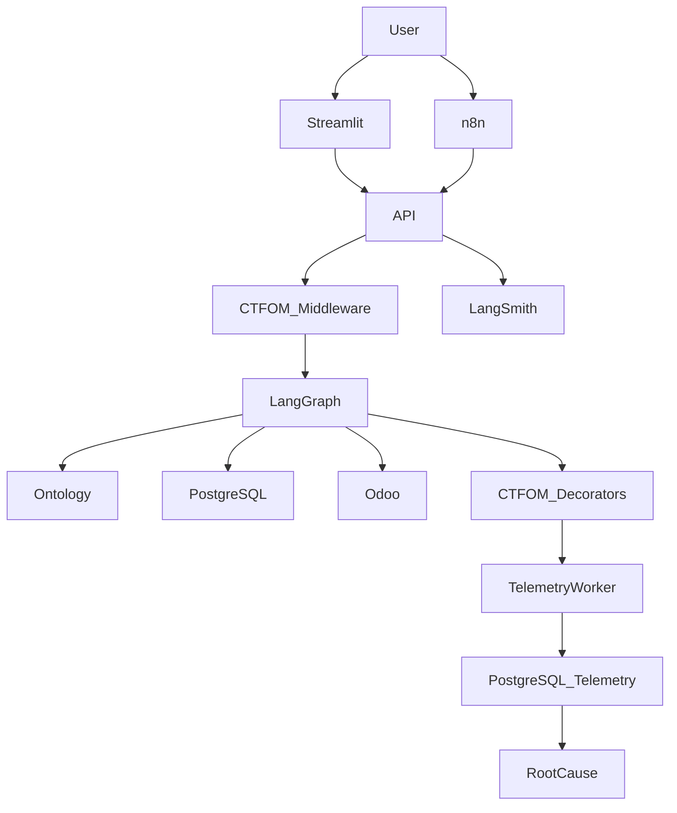

# JARVI 2.0.03 | Agente Cognitivo de Preventa Técnica para AISA Solar & CTFOM (Cognitive Telemetry & Forensic Observability Middleware)

> Arquitectura de agente cognitivo con persistencia de estado serializable, orquestación mediante grafos deterministas, gobernanza forense de eventos auditables, canales de consumo desacoplados y telemetría cognitiva de grado industrial.


---

# Tabla de Contenidos

- [Resumen Ejecutivo](#resumen-ejecutivo)
- [Arquitectura Modular](#arquitectura-modular)
- [Telemetría Cognitiva CTFOM](#telemettría-cognitiva-ctfom)
- [Diseño de Base de Datos](#diseño-de-base-de-datos)
- [Arquitectura Lógica](#arquitectura-lógica)
- [Variables de Entorno](#variables-de-entorno)
- [Canales de Implementación](#canales-de-implementación)
- [Pruebas de Caja Negra](#pruebas-de-caja-negra)
- [Análisis Ontológico y Epistemológico](#análisis-ontológico-y-epistemológico)
- [Stack Tecnológico](#stack-tecnológico)
- [Referencias Técnicas](#referencias-técnicas)
- [Roadmap](#roadmap)
- [Licencia](#licencia)

---

# Resumen Ejecutivo

**JARVI 2.0.03** representa la evolución de la arquitectura agéntica de AISA Solar para preventa técnica fotovoltaica.

Esta versión incorpora el módulo:

**CTFOM — Cognitive Telemetry & Forensic Observability Middleware**

CTFOM introduce una capa de observabilidad cognitiva profunda que transforma el sistema en una plataforma de inteligencia operacional autoconsciente.

El sistema desacopla completamente:

- Canal Web Humano (Streamlit)
- Automatización (n8n)
- Evaluación y trazabilidad (LangSmith)

Toda la lógica de negocio reside en una API central basada en:

- LangGraph
- PostgreSQL
- FastAPI
- Ontologías técnicas
- Auditoría trazable
- Telemetría distribuida end-to-end

---

# Arquitectura Modular

| Componente | Función |
|---|---|
| `api.py` | Servidor central de lógica y middleware CTFOM |
| `agent_graph.py` | Cerebro del agente con nodos instrumentados |
| `streamlit_app.py` | UI web desacoplada |
| `ontology.py` | Ruteo epistemológico |
| `catalog_ontology.json` | Fuente de verdad referencial |
| `odoo_client.py` | Integración ERP |
| `audit.py` | Auditoría forense |
| `config.py` | Variables de entorno |
| `db_migrate_unificado.py` | Migración unificada Core + CTFOM |
| `telemetry.py` | Worker asíncrono de eventos |
| `schemas.py` | Contratos Pydantic |
| `vision.py` | OCR de facturas |

---

# Telemetría Cognitiva CTFOM

El módulo CTFOM agrega observabilidad profunda sin alterar el comportamiento funcional del agente.

Permite:

- Trazabilidad completa de conversaciones (`trace_id`, `span_id`)
- Métricas por nodo
- Verificación de despacho a canales
- Correlación automática de errores
- Root Cause Analysis
- Monitoreo de salud del sistema

## Componentes Lógicos

### 1. Middleware HTTP (`api.py`)
- Genera traza raíz
- Instrumenta requests

### 2. Decoradores de nodos (`agent_graph.py`)
- Instrumentación por span

### 3. Worker batch (`telemetry.py`)
- Inserción no bloqueante

### 4. Tablas de telemetría
- Persistencia optimizada sin particiones manuales

---

# Diseño de Base de Datos

El esquema se crea mediante un único script:

`db_migrate_unificado.py`

Esto garantiza instalación limpia e idempotente de todas las tablas.

No se requiere mantenimiento de particiones: la telemetría reside en tablas normales y las consultas se realizan por filtros temporales:

```sql
WHERE created_at BETWEEN ... AND ...
```

Ideal para herramientas analíticas como **:contentReference[oaicite:0]{index=0}**.

Tablas:

### Núcleo Original
- `checkpoints`
- `checkpoint_blobs`
- `threads`
- `audit_events`

### Módulo CTFOM
- `telemetry_events`
- `dispatch_events`
- `system_health`
- `root_cause_analysis`

---

## Tabla `telemetry_events`

| Campo | Tipo | Descripción |
|---|---|---|
| `id` | BIGSERIAL PK | ID autogenerado |
| `trace_id` | UUID | Traza global |
| `span_id` | UUID | Span actual |
| `parent_span_id` | UUID | Span padre |
| `thread_id` | VARCHAR | Sesión LangGraph |
| `run_id` | VARCHAR | Ejecución LangSmith |
| `layer` | VARCHAR | Capa de sistema |
| `node_name` | VARCHAR | Nodo ejecutado |
| `event_type` | VARCHAR | START / END / ERROR |
| `latency_ms` | INTEGER | Latencia |
| `severity` | VARCHAR | Severidad |
| `error_code` | VARCHAR | Código estructurado |
| `cpu_percent` | FLOAT | CPU |
| `memory_mb` | FLOAT | RAM |
| `dispatch_success` | BOOLEAN | ACK despacho |
| `metadata` | JSONB | Metadata |
| `created_at` | TIMESTAMPTZ | Timestamp |

---

## Tabla `dispatch_events`

| Campo | Tipo |
|---|---|
| `id` | BIGSERIAL PK |
| `trace_id` | UUID |
| `channel` | VARCHAR |
| `payload_hash` | TEXT |
| `dispatch_started` | TIMESTAMPTZ |
| `dispatch_finished` | TIMESTAMPTZ |
| `ack_received` | BOOLEAN |
| `ack_latency_ms` | INTEGER |
| `status` | VARCHAR |
| `error_code` | VARCHAR |
| `metadata` | JSONB |

---

## Tabla `system_health`

| Campo | Tipo |
|---|---|
| `service_name` | TEXT PK |
| `heartbeat_ts` | TIMESTAMPTZ |
| `status` | TEXT |
| `avg_latency_ms` | INTEGER |
| `error_rate` | FLOAT |
| `queue_depth` | INTEGER |

---

## Tabla `root_cause_analysis`

| Campo | Tipo |
|---|---|
| `incident_id` | UUID PK |
| `trace_id` | UUID |
| `primary_failure` | TEXT |
| `secondary_failure` | TEXT |
| `tertiary_failure` | TEXT |
| `confidence` | FLOAT |
| `remediation` | TEXT |
| `created_at` | TIMESTAMPTZ |

---

# Arquitectura Lógica



---

# Variables de Entorno

## Backend (`cliente-api`)

| Variable | Propósito |
|---|---|
| `CHATBOT_MASTER_API_KEY` | Autenticación |
| `OPENAI_API_KEY` | LLM |
| `OPENAI_TRANSCRIPTION_MODEL` | Modelo STT opcional (`gpt-4o-mini-transcribe` por defecto) |
| `OPENAI_TRANSCRIPTION_LANGUAGE` | Idioma STT opcional (`es` por defecto) |
| `MAX_N8N_AUDIO_BYTES` | Limite opcional de audio n8n en bytes |
| `DATABASE_URL` | PostgreSQL |
| `LANGCHAIN_API_KEY` | LangSmith |
| `LANGCHAIN_PROJECT` | Proyecto |
| `LANGCHAIN_TRACING_V2` | Trazabilidad |

## Frontend (`cliente-humano`)

| Variable | Propósito |
|---|---|
| `BACKEND_URL` | Endpoint |
| `CHATBOT_MASTER_API_KEY` | Token API |

---

# Canales de Implementación

## Streamlit

Características:

- Chat web
- Voz
- TTS
- OCR de facturas

## n8n

Automatización vía webhook.

```json
{
  "thread_id": "uuid",
  "message": "Hola necesito paneles solares"
}
```

Headers:

```txt
Authorization: Bearer API_KEY
Content-Type: application/json
```

## LangSmith

Usado para:

- Debugging
- Trazabilidad
- Evaluación de prompts
- Benchmarking

---

# Pruebas de Caja Negra

| ID | Prueba | Resultado Esperado |
|---|---|---|
| BC-T01 | Conversación On-Grid | Clasificación correcta |
| BC-T02 | Conversación Off-Grid | Persistencia correcta |
| BC-T03 | Falla Odoo | Degradación elegante |
| BC-T04 | Integración n8n | API responde |
| BC-T05 | Validación schema | Error 422 |
| BC-T06 | OCR factura | Extracción correcta |
| BC-T07 | Telemetría activa | Eventos registrados |
| BC-T08 | Traza completa | Trace unificado |
| BC-T09 | Despacho verificado | ACK verdadero |
| BC-T10 | Health check | Actualización cada 30s |

---

# Análisis Ontológico y Epistemológico

## Ontología

El sistema modela:

- Productos
- Categorías
- Topologías energéticas
- Estado conversacional
- Entidades de negocio
- Eventos de ejecución
- Incidentes de infraestructura
- Salud de servicios

Capas ontológicas:

1. Ontología de dominio  
2. Ontología de proceso  
3. Ontología de sesión  
4. Ontología de observabilidad  

---

## Epistemología

JARVI obtiene conocimiento desde:

- ERP Odoo → verdad institucional
- Ontología → verdad referencial
- LLM → verdad inferida
- Auditoría → verdad verificable
- Telemetría → verdad operacional

---

# Stack Tecnológico

- Python
- FastAPI
- Streamlit
- LangGraph
- PostgreSQL
- Railway
- Odoo
- OpenAI
- LangSmith
- n8n
- psutil
- asyncio

---

# Referencias Técnicas

- ISO/IEC 42001
- ISO/IEC 27001
- ISO/IEC 25010
- ISO/IEC 29119
- OpenTelemetry Specification
- Google SRE Book
- LangGraph API Docs
- PostgreSQL Docs
- FastAPI Docs

---

# Roadmap

## Memoria Semántica
Uso de `pgvector`.

## Integración Total con Odoo
Catálogo dinámico.

## Agentes Especialistas
- On-Grid
- Off-Grid
- Bombeo
- Solar térmico

## Predictive Bottleneck Engine
Machine Learning para predicción de cuellos de botella.

## Reflexive Truth Engine
Autoajuste de prompts basado en telemetría operacional.

---

# Licencia

Uso interno de AISA Solar.
